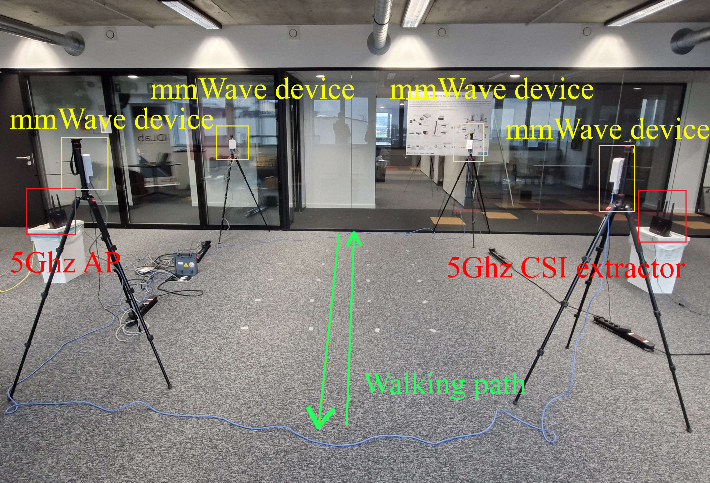
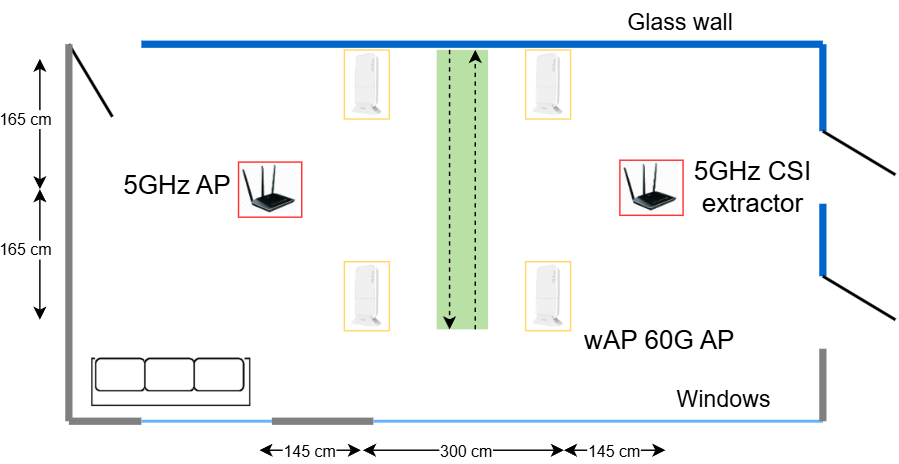

# mmWave vs sub-6 GHz for Wi-Fi-based Person Identification

This repository contains the code and data pipeline for the experiments in the master's thesis:

**"Comparative Study of Person Identification Using  Sub-6 GHz and mmWave Wi-Fi CSI"**  
by Maksim Karnaukh, 2025

The project investigates and compares the effectiveness of sub-6 GHz (5 GHz) 
and mmWave (60 GHz) Wi-Fi signals for gait-based person identification using deep learning. 
It includes the synchronized CSI datasets collected with COTS hardware and benchmarks 
multiple neural network architectures in an end-to-end training pipeline.

**Abstract (from the paper):**

Person identification plays a vital role in enabling
intelligent, personalized, and secure human-computer interaction.
Recent research has demonstrated the feasibility of leveraging
Wi-Fi signals for passive person identification using a person’s
unique gait pattern. Although most existing work focuses on sub6 GHz (5 GHz) frequencies, the emergence of mmWave (60 GHz)
Wi-Fi offers new opportunities through its finer spatial resolution
(5mm wavelength vs. 6cm at 5GHz), though its comparative
advantages for person identification remain unexplored. This
work presents the first comparative study between sub-6 GHz and
mmWave Wi-Fi signals for person identification with commodity
hardware, using a custom-collected dataset of synchronized measurements from both frequency bands in an indoor environment.
To ensure a fair comparison, we apply identical training pipelines
and model configurations across both frequency bands. By doing
experiments with multiple deep learning architectures in an end-to-end manner, we demonstrate that for low-rate sampling (10
Hz), 60 GHz signals can achieve superior performance (91.2%
average accuracy for 20 individuals) when proper background
subtraction is applied, particularly for larger groups of individuals. However, high-rate 5 GHz sampling (200 Hz) can very well
match low-rate mmWave performance in certain configurations.
We study the trade-offs between frequency bands in terms of data
efficiency, temporal resolution requirements, and robustness to
environmental variations.

---

## Evaluated Environment

The experiments were run using the following main environment:

- Python 3.12
- PyTorch 2.5.1 (with CUDA 11.8)
- CUDA Toolkit 11.8
- OS: Ubuntu 22.04
- GPU: NVIDIA RTX 4090 (local machine)

To reproduce the environment, install dependencies from `requirements.txt` in the root directory:
    
```bash
pip install -r requirements.txt
```
---

## Usage

For the project structure, refer to the `README_PROJECT_STRUCTURE` file in the root directory. <br>
The experiment notebooks in the `src/` directory can be run as is.

---

## Data Collection Hardware

This project used two hardware setups to collect CSI data from sub-6 GHz and mmWave Wi-Fi signals in a synchronized manner.

### Sub-6 GHz (5 GHz) Setup
- **Routers:** 2 × ASUS RT-AC86U
  - One as Access Point (AP)
  - One as passive CSI monitor
- **Laptop:** Intel-based laptop transmitting ICMP echo requests (~300 Hz)
- **Firmware:** Nexmon CSI tool for Broadcom BCM4366c0
  - Nexmon version: `10_10_122_20`
  - 802.11ac, 80 MHz channel (Channel 36)
- **CSI Format:** Amplitude-only values for 52 subcarriers
- **CSI Specs:**
  - 64 subcarriers (52 data subcarriers used)

### mmWave (60 GHz) Setup
- **Devices:** 4 × MikroTik wAP 60G (COTS 60 GHz Wi-Fi devices)
  - Devices placed in an X-formation (cross-shape)
- **Firmware:** Open-source toolchain on custom OpenWRT firmware
- **CSI Format:** Amplitude-only values for 30+30=60 antenna elements 
- **CSI Specs:**
    - 30 antenna elements used (hardware limitation)

Both hardware setups operated in a shared indoor environment to allow 
synchronized data collection during walking sessions. 

The figures below show the device placement during data collection:





---

## Citation of the paper

```
@...{karnaukh2025mmwave,
  title     = {Comparative Study of Person Identification Using Sub-6 GHz and mmWave Wi-Fi CSI},
  author    = {Your Name},
  year      = {2025},
  ...
}
```
